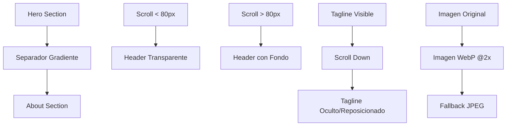

# Diseño: Armonía Visual Hero-About

## Overview

Este documento detalla el diseño para crear una transición visual armoniosa entre la sección hero y la sección "Sobre Mí", manteniendo la narrativa oceánica y mejorando la experiencia de usuario. El enfoque se centra en:

1. Implementar transiciones fluidas entre secciones usando gradientes y elementos ondulados
2. Mejorar la legibilidad de la navegación con fondos adaptativos al scroll
3. Optimizar la jerarquía visual ocultando/reposicionando el tagline
4. Actualizar la imagen de la sección About con calidad profesional
5. Ajustar espaciado y fondos para crear respiración visual
6. Mantener consistencia tipográfica y de color con el hero

## Architecture

La solución se basa en la arquitectura existente que utiliza:

- **CSS/Tailwind**: Para estilos, transiciones y layout responsive
- **JavaScript**: Para comportamiento dinámico del header al hacer scroll
- **HTML semántico**: Estructura optimizada para la nueva armonía visual
- **Optimización de assets**: Imágenes WebP de alta calidad

### Componentes Principales

1. **Separador de Transición**: Elemento visual que conecta hero con About
2. **Header Adaptativo**: Navegación que cambia según la posición del scroll
3. **Sección About Mejorada**: Layout, espaciado y fondos optimizados
4. **Sistema de Imágenes**: Assets optimizados para diferentes densidades de pantalla

## Components and Interfaces

### 1. Separador de Transición Hero → About

**Propósito**: Crear continuidad visual entre la ola del hero y la sección About

```html
<!-- Separador ondulado con gradiente -->
<div class="h-24 bg-gradient-to-b from-transparent via-white/60 to-white lg:h-32 -mt-1">
  <!-- Opcional: SVG ondulado para eco de la ola -->
</div>
```

**Características**:
- Gradiente suave que mantiene la paleta oceánica
- Altura responsive (24 en móvil, 32 en desktop)
- Margen negativo para eliminar gaps
- Opción de SVG ondulado para reforzar la narrativa visual

### 2. Header Adaptativo con Scroll

**Propósito**: Mantener legibilidad de la navegación en todo momento

```javascript
// Comportamiento del header al hacer scroll
window.addEventListener('scroll', () => {
  const header = document.querySelector('header');
  const scrollY = window.scrollY;
  
  if (scrollY > 80) {
    header.classList.add('bg-dark/80', 'backdrop-blur-sm');
  } else {
    header.classList.remove('bg-dark/80', 'backdrop-blur-sm');
  }
});
```

**Características**:
- Activación a partir de 80px de scroll
- Fondo oscuro semi-transparente (bg-dark/80)
- Efecto blur sutil para profesionalidad
- Transición suave CSS

### 3. Gestión del Tagline

**Propósito**: Reducir ruido visual y mejorar jerarquía

**Opción A - Ocultar al hacer scroll**:
```javascript
// Ocultar tagline progresivamente
const tagline = document.querySelector('.tagline');
const scrollY = window.scrollY;
const opacity = Math.max(0, 1 - scrollY / 200);
tagline.style.opacity = opacity;
```

**Opción B - Mover a sección About**:
```html
<!-- Integrar como introducción sutil en About -->
<section id="about">
  <div class="max-w-7xl mx-auto">
    <p class="text-sm text-gray-600 mb-8 italic">
      <!-- Tagline reposicionado -->
    </p>
  </div>
</section>
```

### 4. Sección About Mejorada

**Propósito**: Crear armonía visual y espaciado óptimo

```html
<section id="about" class="bg-[#f9fbfd] lg:bg-white pt-24 lg:pt-32 pb-24">
  <div class="max-w-7xl mx-auto grid grid-cols-1 lg:grid-cols-2 gap-16 px-6">
    <!-- Texto con tipografía consistente -->
    <article class="prose lg:prose-lg text-gray-800 max-w-none">
      <h2 class="font-serif text-4xl lg:text-5xl mb-4 relative">
        Sobre Mí
        <span class="absolute -bottom-1 left-0 w-1/3 h-1 bg-accent rounded-full"></span>
      </h2>
      <p class="text-lg leading-relaxed">...</p>
    </article>
    
    <!-- Imagen optimizada -->
    <figure class="rounded-2xl overflow-hidden shadow-xl">
      
    </figure>
  </div>
</section>
```

## Data Models

### Configuración de Colores

```css
:root {
  --color-accent: #3b82f6; /* Azul océano para subrayados */
  --color-bg-about: #f9fbfd; /* Fondo neutro claro */
  --color-bg-about-alt: #ecf7ff; /* Alternativa gris-azul pálido */
  --color-header-scroll: rgba(15, 23, 42, 0.8); /* Header con scroll */
}
```

### Breakpoints Responsive

```css
/* Espaciado responsive */
.about-spacing {
  padding-top: 6rem; /* 24 en móvil */
}

@media (min-width: 1024px) {
  .about-spacing {
    padding-top: 8rem; /* 32 en desktop */
  }
}
```

## Error Handling

### Fallbacks de Imagen

1. **Formato WebP no soportado**: Fallback a JPEG optimizado
2. **Imagen no carga**: Placeholder con color de fondo coherente
3. **Conexión lenta**: Lazy loading y progressive enhancement

```html
<picture>
  <source srcset="/images/kayak-waterfall@2x.webp" type="image/webp">
  <source srcset="/images/kayak-waterfall@2x.jpg" type="image/jpeg">
  
</picture>
```

### JavaScript Graceful Degradation

```javascript
// Verificar soporte antes de aplicar efectos
if ('IntersectionObserver' in window) {
  // Implementar scroll effects
} else {
  // Fallback estático
}
```

## Testing Strategy

### Pruebas Visuales

1. **Transición Hero → About**:
   - Verificar suavidad del gradiente en diferentes navegadores
   - Comprobar que no hay gaps o saltos visuales
   - Validar en diferentes tamaños de pantalla

2. **Header Adaptativo**:
   - Probar activación a 80px de scroll
   - Verificar legibilidad sobre diferentes fondos
   - Comprobar transiciones suaves

3. **Calidad de Imagen**:
   - Verificar nitidez en pantallas de alta densidad
   - Probar carga en conexiones lentas
   - Validar formatos WebP vs fallbacks

### Pruebas de Rendimiento

1. **Optimización de Assets**:
   - Medir tiempo de carga de imágenes optimizadas
   - Verificar que lazy loading funciona correctamente
   - Comprobar que las transiciones no afectan el rendimiento

2. **Scroll Performance**:
   - Verificar que los event listeners no causan lag
   - Probar en dispositivos de gama baja
   - Optimizar frecuencia de actualización

## Decisiones de Diseño

### 1. Separador de Transición

**Decisión**: Usar gradiente CSS en lugar de SVG complejo
**Razón**: 
- Mejor rendimiento
- Más fácil de mantener
- Responsive automático
- Menor peso de página

### 2. Colores de Fondo

**Decisión**: `#f9fbfd` para móvil, blanco para desktop
**Razón**:
- Suaviza la transición en pantallas pequeñas
- Mantiene limpieza en desktop
- Armoniza con la paleta oceánica
- Mejora la legibilidad

### 3. Espaciado Vertical

**Decisión**: `pt-24` móvil, `lg:pt-32` desktop
**Razón**:
- Crea respiración visual adecuada
- Evita sensación de agobio
- Proporcional al tamaño de pantalla
- Consistente con el sistema de espaciado

### 4. Optimización de Imagen

**Decisión**: WebP @2x con fallbacks
**Razón**:
- Calidad profesional en pantallas de alta densidad
- Optimización de peso con WebP
- Compatibilidad con fallbacks
- Lazy loading para rendimiento

## Consideraciones Adicionales

### Accesibilidad

- Mantener contraste mínimo 4.5:1 en todos los elementos
- Asegurar que las transiciones no causen mareos
- Proporcionar alternativas para usuarios con motion sensitivity

### SEO y Performance

- Lazy loading de imágenes below-the-fold
- Preload de assets críticos
- Optimización de Core Web Vitals

### Mantenibilidad

- Usar variables CSS para colores y espaciados
- Comentarios claros en el código
- Estructura modular para futuras modificaciones

## Mermaid Diagram - Flujo de Transición



Este diseño asegura una experiencia visual cohesiva que mantiene la narrativa oceánica del hero mientras mejora significativamente la transición hacia la sección About.